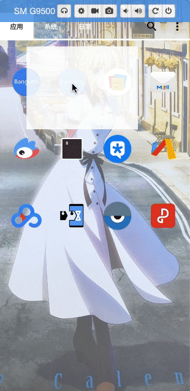

# Bangumi
一个追番和看番的Android应用

# 说明
本项目是新手练习项目, 采用MVVM架构, 基于Jetpack部分组件开发;
打包好的apk已放在release文件夹下, 感兴趣的朋友可以下载体验一下。

# 近期更新（2019.11.19）
- 可以设置侧滑打开侧栏

# 功能
- 视频本地缓存
- 追番
- 主页切换
- 滑动调节亮度, 音量, 进度
- 视频调速
- 视频记忆

# 支持网站
- [zzzfun](http://www.zzzfun.com/)
- [dilidili](http://www.dilidili.name/)
- [樱花动漫](http://www.imomoe.io/)
- [nico动漫](http://www.nicotv.me/dongman)
- [silisili](http://www.silisili.me/)
- [奇米奇米](http://www.qimiqimi.co/)
- [嘛哩嘛哩](http://www.malimali.com/)

# 参考的项目
- [giffun](https://github.com/guolindev/giffun)
- [sunflower](https://github.com/android/sunflower)
- [coolweatherjetpack](https://github.com/guolindev/coolweatherjetpack)

# 应用截图

 
 

 
 

 
 

